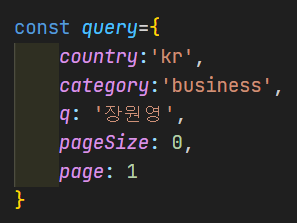

# 사용방법
- ## let data = fakeServer.fetchData({country:'kr'})

처럼, fetchData() 함수 안에 객체를 인자로 전달하면 됩니다.

- fetchData에 전달할 객체형태는

과 같은 형태입니다.

콘솔을 살펴보면, 받아온 데이터를 자세히 볼 수 있습니다.

각 속성값(country, category.....)중에서 한 가지만 입력해도 됩니다.

pageSize를 입력하지 않으면 디폴트로 10,

page를 입력하지 않으면 디폴트로 1 이 됩니다.

country로는 'kr', 'us' 가 있고,

category로는 'business', 'entertainment', 'general', 'kr', 
'kr-enter' 가 있고,

q는 검색하고자 하는 단어을 입력하면 됩니다. (영어, 한글 모두 가능) 

## 그런데, country, category, q는 한꺼번에 입력하면 안됩니다!!!

이 중에 한가지만! 입력해야 됩니다.

즉, fetchData({country: 'us', category:'business'}) --> 안됨.

fetchData({category: 'kr-enter', q: 'bts'}) --> 안됨

fetchData({country:'us', page:1, pageSize:5}) --> 가능합니다.

### 깃허브의 내용을 clone 한 후에

### 위 그림처럼 script3.js 파일에서, fakeServer의 기다란 코드의 내용을 축약시키고

### 아래에서 데이터를 받아오는 코드를 작성하시면 됩니다.

### index3.html와 script3.js가 연계되게 해 놓았는데,

### index3.html을 실행시키고, 콘솔을 확인하면 작동원리를 알 수 있습니다.

### 확인을 한 이후에는 fakeServer 객체를 이용해서 여러분들의 프로젝트를 만드시면 됩니다.